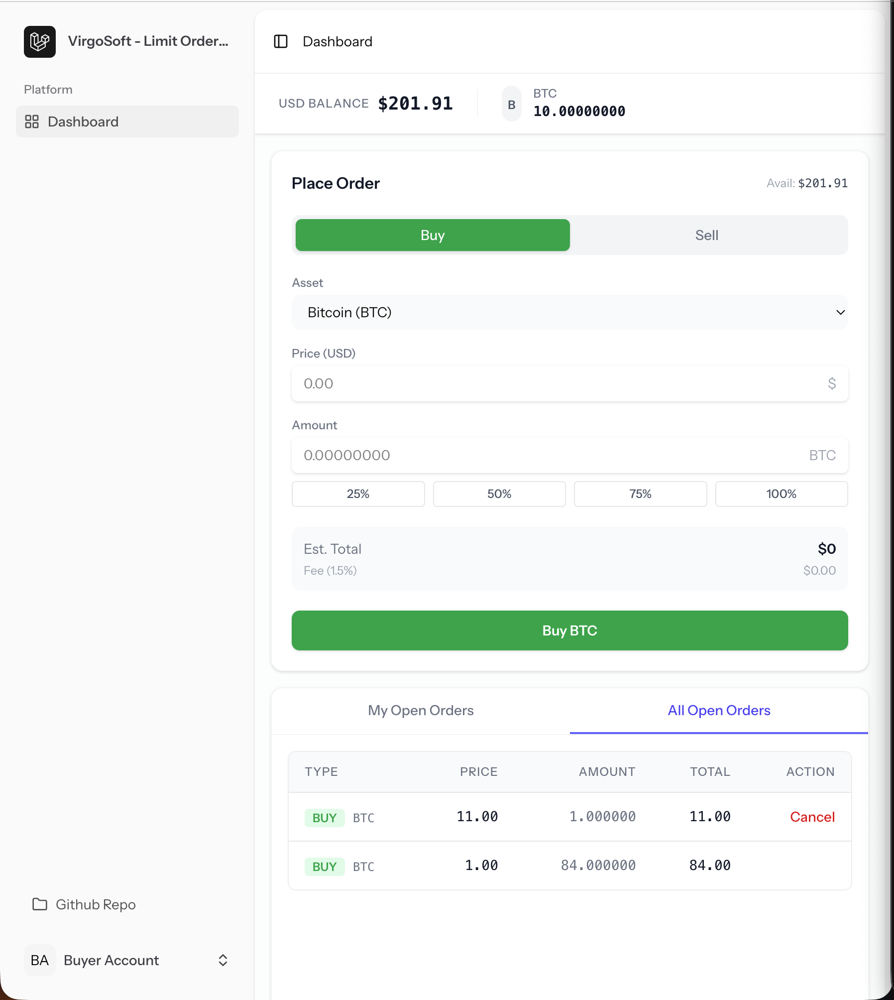
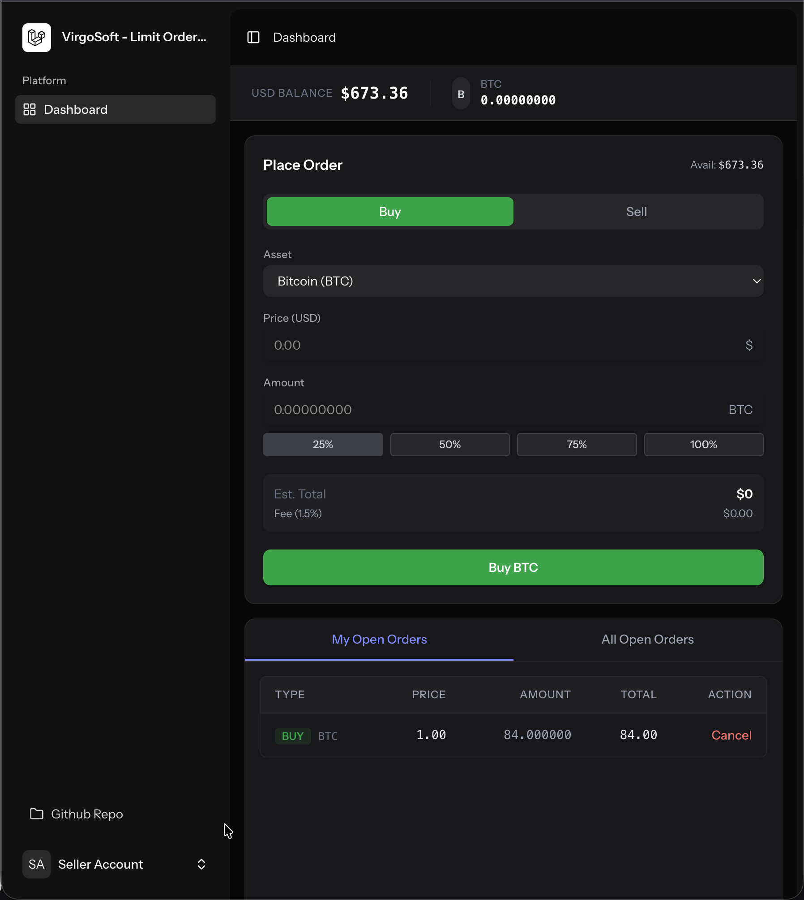
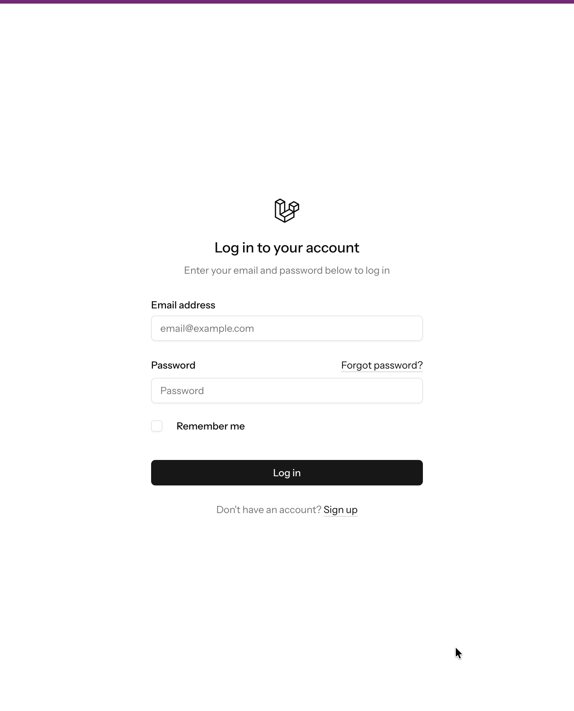
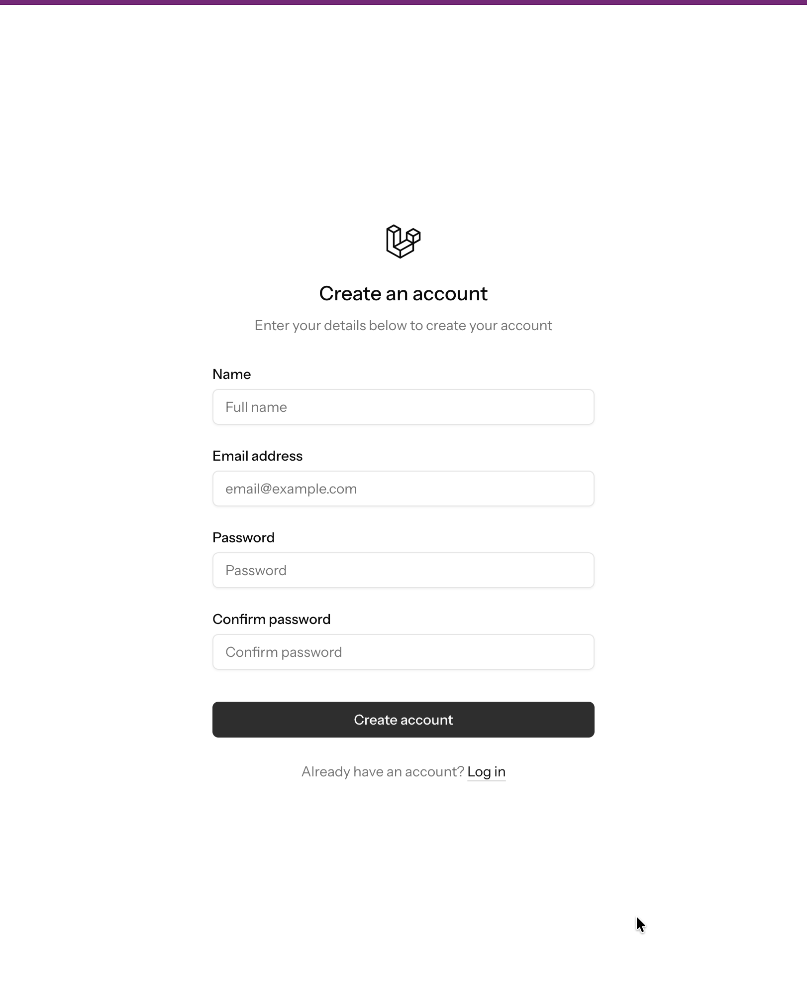
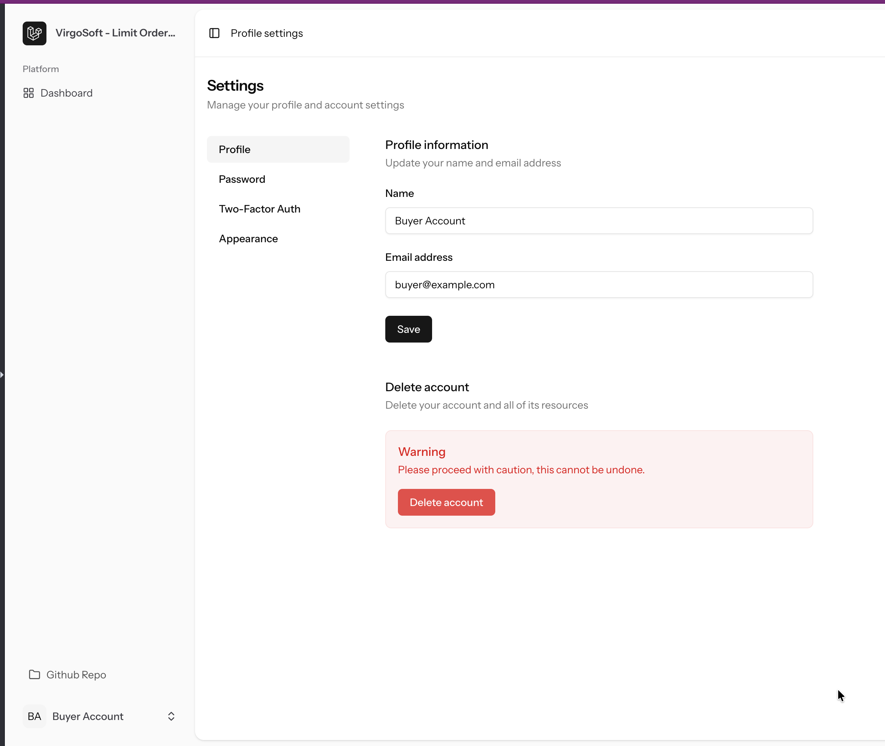

# VirgoSoft Trading Platform Assessment

Welcome to the **VirgoSoft Trading Platform**. This is a high-performance, real-time trading application simulation built with modern web technologies. It allows users to manage their assets, place buy/sell orders, and experience real-time order matching and updates.

## 🚀 Product Overview

The platform provides a seamless trading experience with features including:

- **User Dashboard**: View real-time balance updates and asset portfolio performance.
- **Order Management**: Place Limit orders to Buy or Sell assets (e.g., BTC/USD).
- **Real-time Matching Engine**: An atomic, transaction-safe matching service that automatically executes trades when Buy and Sell orders overlap in price.
- **Live Updates**: Powered by **Laravel Reverb**, receive instant notifications and balance updates via WebSockets without refreshing the page.
- **Secure Authentication**: Robust user authentication and security handling.

## 🛠️ Technology Stack

This project leverages the bleeding edge of the Laravel ecosystem:

- **Framework**: Laravel 12 (PHP 8.2+)
- **Frontend**: Vue.js 3 + Inertia.js v2 + TailwindCSS v4
- **Real-time Communication**: Laravel Reverb (WebSockets)
- **Database**: SQLite (default) / MySQL ready
- **Testing**: PestPHP v3

## ⚡ Getting Started

Follow these instructions to set up the project locally.

### Prerequisites

- PHP 8.2 or higher
- Composer
- Node.js & NPM

### Installation

1. **Clone the Repository**

   ```bash
   git clone <repository-url>
   cd virgosoft-assessment-laravel
   ```

2. **Run Setup Script**
   We have streamlined the setup process into a single command which installs PHP/Node dependencies, sets up the `.env` file, generates keys, migrates the database, and builds assets.

   ```bash
   composer run setup
   ```

### Database Seeding

To populate the application with initial test users and data, run the seeder:

```bash
php artisan db:seed
```

This will create test users (e.g., `test@example.com` / `password`) and initial market data.

## 🏃‍♂️ Running the Application

To start the development environment, including the Laravel server, Vite hot-reload, Queue worker, and Reverb WebSocket server, run:

```bash
composer run dev
```

Access the application at: `http://localhost:8000` (or the URL provided in your terminal).

## ✅ Running Tests

To ensure everything is working correctly, you can run the test suite using Pest:

```bash
composer run test
```

## 📂 Key Architecture Highlights

- **`MatchingService`**: The core logic for order matching, refactored for readability and atomic transactional safety using `App\Enums\OrderStatus`.
- **`OrderService`**: Handles order validation, fund locking/deduction, and cancellation logic with strict helper methods.
- **Global Exception Handling**: Centralized error management for consistent API responses (`ClientException`, `ServerException`).
- **Standardized Controllers**: Slim controllers (`OrderController`) delegating business logic to services.

## 📸 Screenshots

### Dashboard (Light Mode - Buyer)



### Dashboard (Dark Mode - Seller)



### Authentication

|                   Login                   |                      Registration                       |
| :---------------------------------------: | :-----------------------------------------------------: |
|  |  |

### Settings



---
